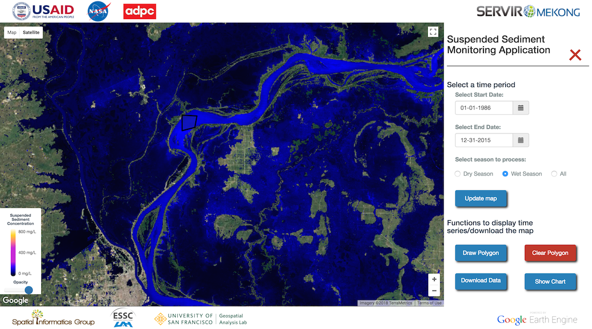

# Mekong Water Quality

This repository is a [Google AppEngine](https://cloud.google.com/appengine/) application that uses [Google Earth Engine](https://earthengine.google.com/) to dynamically map surface suspended solid concentration within water bodies in the Mekong Basin using Landsat satellite data. The live application can be found at [mekong-ssc.appspot.com](http://mekong-ssc.appspot.com)



If you use the code from this repository or use any data from the application, please consider citing the following research article: Markert, K.N., Schmidt, C.M., Griffin, R.E., Flores, A.I., Poortinga, A., Saah, D.S., Muench, R.E., Clinton, N.E., Chishtie, F., Kityuttachai, K., Someth, P., Anderson, E.R., Aekakkararungroj, A., and Ganz, D.J. (2018), Historical and Operational Monitoring of Suspended Sediment in the Lower Mekong Basin using Landsat and Google Earth Engine Cloud Computing. Remote Sens., 10(6), 909, https://doi.org/10.3390/rs10060909

## Getting started

To set up your own instance of the application, you will need the [Google Cloud SDK](https://cloud.google.com/sdk/) installed and a [cloud project](https://cloud.google.com/resource-manager/docs/creating-managing-projects) created. Once your project is setup, you will need to create a [service account](https://cloud.google.com/iam/docs/creating-managing-service-accounts) and get that service account [whitelisted by the Earth Engine](https://developers.google.com/earth-engine/service_account) team.

After you have your project setup on Google Cloud, you will interface with your project using the Google Cloud SDK command line interface. To start, you will configure your `gcloud` environment with your username and login:

```
$ gcloud config set account <YOUR_ACCOUNT>
$ gcloud auth
```

After you successfully login, you will need to set the project in the `gcloud` configuration:

```
$ gcloud config set project <YOUR_PROJECTID>
```

Now we are ready to pull the GitHub repository and make minor changes to the code for your specific project:

```
$ git clone https://github.com/kmarkert/mekong-ssc-gae.git
$ cd mekong-ssc-gae
```

Specifically, **you will need to change lines 5 and 11 in `config.py` for your specific service account and credentials**.

Last step is to deploy your application to the cloud:
```
$ gcloud app deploy
```

The Google Cloud SDK will walk you through some configuration for the application and then your application is live! You can check your application at http://<YOUR_PROJECTID>.appspot.com


## Contributing

If you have any ideas, just [open an issue](https://github.com/KMarkert/mekong-ssc-gae/issues/new) and let me know what you think.

If you'd like to contribute, please fork the repository and make changes as you'd like. Pull requests are welcome!
